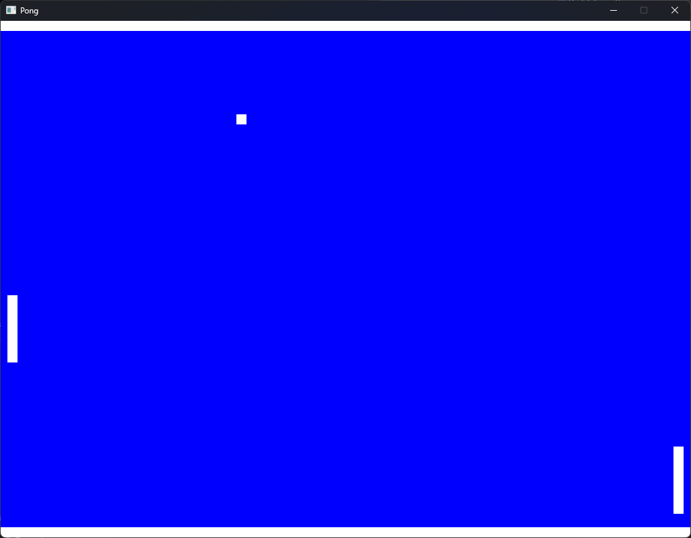
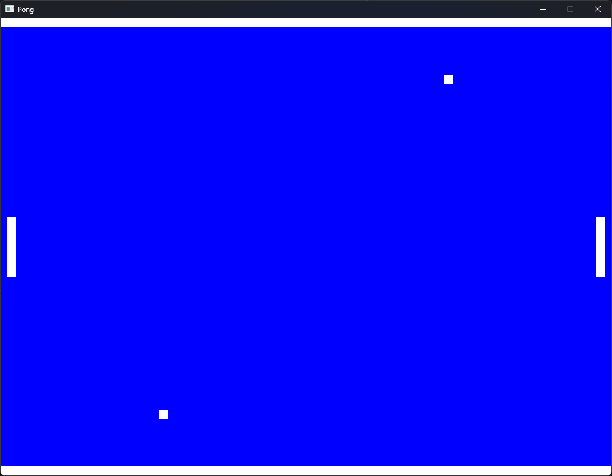

# Pong Game Implementation with C++ and SDL3

## Overview
This project is an implementation of the classic Pong game using C++ and the SDL3 library. The game features two paddles controlled by players and one or more balls that bounce around the screen. The project has two branches:
- **main branch**: Traditional Pong with one ball.
- **multiball branch**: Enhanced version with multiple balls for increased challenge.

## Features
- Two-player gameplay with paddle controls:
  - Player 1: W (up) and S (down) keys.
  - Player 2: I (up) and K (down) keys.
- Ball physics with acceleration over time.
- Collision detection with paddles and walls.
- Game ends when a ball exits the left or right boundary.

## Requirements
- C++ compiler (supporting C++11 or later).
- SDL3 library installed on your system.

## Installation
1. Clone the repository.
2. Install **Microsoft Visual Studio** and then open **Pong.sln**. 
3. To use SDL3 package, edit your project properties in Microsoft Visual Studio:
- Add the include directory to "VC++ Directories" -> "Include Directories"
- Add the lib/_arch_ directory to "VC++ Directories" -> "Library Directories"
- Add SDL3.lib to Linker -> Input -> "Additional Dependencies"
- Copy lib/_arch_/SDL3.dll to your project directory.

## Screenshots
 
